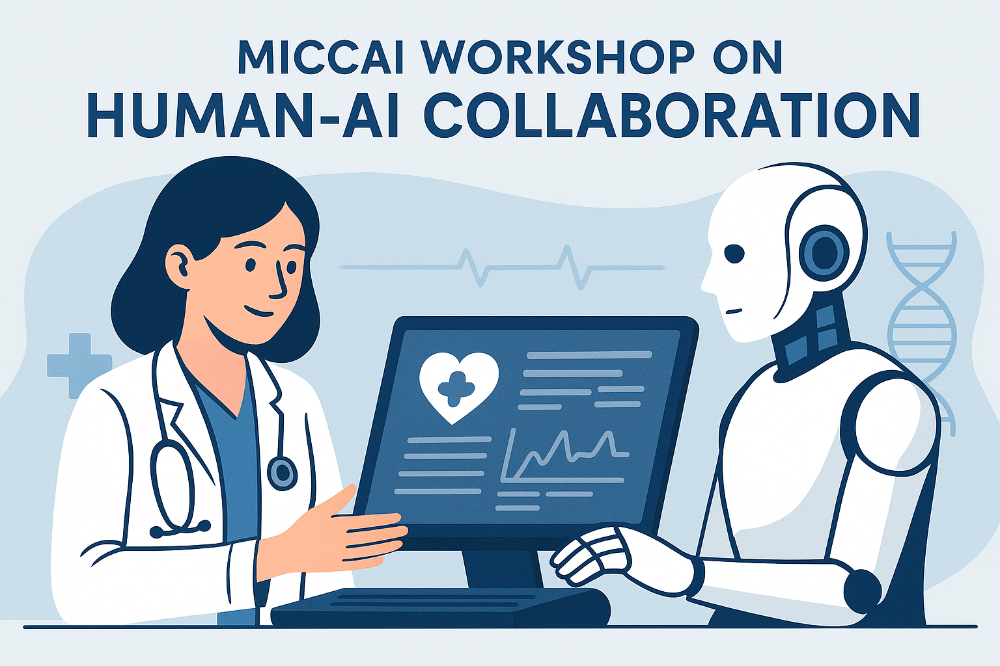

# The 2nd MICCAI Workshop on Human-AI Collaboration (HAIC)

## Overview

The sustained success of AI-integrated clinical and research environments depends not only on model performance, but also how clinicians, researchers, and AI systems work together. Human-AI collaboration remains central to safe deployment, effective workflow integration, and enhancement of competency and professional growth for the future healthcare workforce.

**The 2nd MICCAI Workshop on Human-AI Collaboration (HAIC)** will continue the discussion started in [HAIC 2025](https://haic-miccai.github.io/#/previous-events/haic-2025) and offer the systematic discussion forum addressing all aspects of **human-AI collaboration, interaction, and human skill augmentation** for the MICCAI community. Moving beyond conventional divisions of MIC or CAI, the workshop focuses on a human-centered dimension: how human and AI collaborate and co-evolve to improve clinical outcomes today and support future workforce development and technological evolution. 

The workshop is to be held in conjunction with [MICCAI 2026](https://conferences.miccai.org/2026/en/default.asp).

## News

[March 31, 2026] We are excited announce The 2nd MICCAI Workshop on Human-AI Collaboration!

[March 31, 2026] We are preparing the 2026 call for papers and welcome expressions of interest from the community.

## Call for Papers

We call for works that cover innovative methodologies, validation, application, or best practices for human-AI interaction, collaboration, human factors modeling, and human skill analysis/augmentation in medical image computing and computer-assisted interventions. Please find it below a non-exhaustive list of themes and topics.

New for 2026: We introduce both a **Standard Paper** track (8 pages, unpublished MICCAI-formated original work) and a **Short & Positional Paper** track (4 pages; original or a summary of a previously published/preprinted work since July 1, 2025, or position papers).

### List of Themes

**Human-AI collaborative approaches and joint decision making**

- Interactive predictors, including interactive classification, detection, and segmentation
- Joint decision approaches combining human expertise and AI insights
- Human-AI collaborative and assistive agents

**Medical procedure analysis for human skill understanding and augmentation**

- Image and video analysis for imaging and intervention procedures
- Human behavior modeling in medical procedures
- Human behavior / human factor modeling and analysis in medical procedures
- AI-assisted guidance and navigation for imaging and intervention
- AI-assisted medical text mining
- AI-accelerated medical science: hypothesis generation, experiment planning, implementation, and outcome interpretation

**Emerging techniques for human-AI interaction and communication**

- Multimodal models that incorporate textual information (e.g., for medical question answering, diagnosis, and/or treatment planning)
- Incorporating human-friendly inputs: natural language, audio, gesture, and gaze
- Patient-facing models

**Human-in-the-loop model training and fine-tuning**

- Interactive learning and fine-tuning approaches
- Active learning approaches
- Incorporating structured and unstructured human feedback in training and fine-tuning

**Boosting transparency, interpretability, and risk management for joint human-AI systems**

- Explainable medical AI and its impact on joint decisions
- Out-of-distribution management, hallucination mitigation, and decision deferrals
- Uncertainty modeling, propagation, and communication
- Learning to safeguard AI and human users

**Interactive environments for clinical training, education, and human-AI teaming outcomes**

- AI assistants for medical education
- Simulation environments for clinical training and skill enhancement
- Virtual, augmented, and mixed reality applications for HAIC

**Design and assessment for joint systems and workflows**

- Constructing new evaluation datasets
- Identifying clinically accepted evaluation metrics or gold standards
- Case studies of human-AI joint workflows

**Applications and positional papers: involving any of the above elements**

### Author Guidelines

**New for 2026** To promote the dissemniation of knowledge, we introduce the Standard Paper Track and Short \& Positional Paper Track. 

#### Standard Paper (8-page, unpublished original work)

**Scope:** Original works that within the workshop's themes.

**Format:** Submissions should follow the MICCAI 2026 formatting guidance: 8-page main content + 2-page references, LNCS-style.

#### Short \& Positional Paper (4-page, original or a summary to a published work by the authors)

**Scopes:** 
1. Original works winthin the workshop's themes
2. A short summary of published/preprinted works by the authors that are within the workshop's themes. The referenced work(s) must have been first released no earlier than July 1, 2025. *Note: Summary papers of existing works will be invited for presentation but will not be included into workshop proceedings*
3. Positional papers that do not fit within the Standard Paper Track

**Format:** Submissions are expected to follow the LNCS-style with up to 4 pages + 2 pages of references. 

---

**Review Process:** All submissions are expected to undergo double-blind (single-blind for summaries to published works in the short paper track) peer review by multiple reviewers.

**Presentations:** Accepted submissions are expected to be presented in person. Oral, spotlight, and poster allocations will be announced after review.

**Workshop Proceedings:** We expect to continue pursuing workshop proceedings in the Springer Lecture Notes in Computer Science (LNCS) series, subject to final confirmation.

### Submission Guidelines

**Submission Portal:** TBA

**Submission Deadline:** TBA

## Program 

### Invited Speakers (Tentative)

- [Ben Attwood](https://www.kellogg.ox.ac.uk/our-people/ben-attwood/) (Chief Digital and Information Officer, Oxford University Hospitals NHS Foundation Trust) 

- [James Zou](https://www.james-zou.com/) (Associate Professor of Biomedical Data Science, Stanford University)

- [Daguang Xu](https://research.nvidia.com/person/daguang-xu) and [Bruce Hashemian](https://research.nvidia.com/person/daguang-xu) (Senior Research Manager / Chair of the NOMAI Human-AI Interaction Working Group, NVIDIA) 

### Program Schedule

TBA

## Important Dates

| Date | Milestone |
|---|---|
| **Paper submission due** | TBA  |
| Notification of decisions | July 2026 (TBA) |
| Camera-ready papers due | August 2026 (TBA) |
| **Workshop date** | **October 2026 (TBA)** |

<em>(Tentative timeline; final dates will be confirmed later.)</em>

## Organizers

*Alphabetical order by last name*

### Organization Committee

- [Xiaoqing Guo](https://guo-xiaoqing.github.io/) (Hong Kong Baptist University)
- [Yueming Jin](https://yuemingjin.github.io/) (National University of Singapore)
- [Hala Lamdouar](https://hlamdouar.github.io/) (University of Oxford)
- [Qianhui Men](https://qianhuimen.github.io/) (University of Bristol)
- [Cheng Ouyang](https://cheng-01037.github.io/) (University of Oxford)
- [Manish Sahu](https://sahumanish.github.io) (Johns Hopkins University)
- [S. Swaroop Vedula](https://malonecenter.jhu.edu/people/swaroop-vedula/) (Johns Hopkins University)

### Advisory Board

- [Qi Dou](http://www.cse.cuhk.edu.hk/~qdou/) (Chinese University of Hong Kong)
- [Helen Higham](http://www.cse.cuhk.edu.hk/~qdou/) (University of Oxford)
- [Pierre Jannin](https://medicis.univ-rennes1.fr/members/pierre.jannin/index) (University of Rennes)
- [Nassir Navab](http://www.cse.cuhk.edu.hk/~qdou/) (Technical University of Munich)
- [Alison Noble](https://ibme.ox.ac.uk/person/alison-noble/) (University of Oxford)
- [Pranav Rajpurkar](https://dbmi.hms.harvard.edu/people/pranav-rajpurkar) (Harvard University)

### Industry Board

- [Bruce Hashemian](https://github.com/bhashemian) (NVIDIA)    
- [Daguang Xu](https://research.nvidia.com/person/daguang-xu) (NVIDIA)

### Student Borad

- [Haoxin Chen](https://scholar.google.com/citations?user=63XFxHgAAAAJ&hl=zh-CN) (Hong Kong Baptist University)
- [Sue Min Cho](https://suemincho.com/) (Johns Hopkins University)
- [Anjie Le](https://ale256.github.io/) (University of Oxford)
- [Emily Peacock](https://ibme.ox.ac.uk/person/emily-peacock/) (University of Oxford)
- [Ziyue Wang](https://www.linkedin.com/in/ziyue-wang-4a06a7233) (National University of Singapore)

Program committee updates for the 2026 edition will be announced soon. The 2025 archive remains available from the sidebar for the previous committee list and full historical program.

## Sponsors

Sponsorship opportunities for the 2026 edition will be shared soon.

## Awards

To be announced.

## Contact

For general inquiries, please contact miccai.haic@gmail.com.

  

