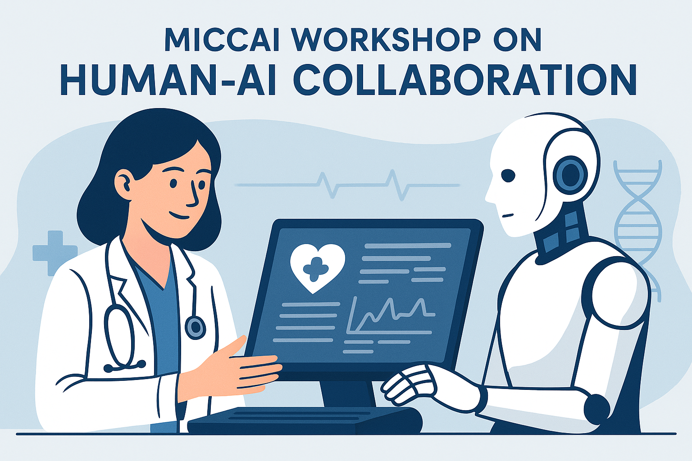

# The 2nd MICCAI Workshop on Human-AI Collaboration (HAIC 2026)

**Room Leicester, Strasbourg Convention Center**  
**13:30, October 1, 2026** 

## Overview

The sustained success of AI-integrated clinical and research environments depends not only on model performance, but also how clinicians, researchers, and AI systems work together. Human-AI collaboration remains central to safe deployment, effective workflow integration, and enhancement of competency and professional growth for the future healthcare workforce.

**The 2nd MICCAI Workshop on Human-AI Collaboration (HAIC 2026)** will continue the discussion started in [HAIC 2025](https://haic-miccai.github.io/#/previous-events/haic-2025) and offer the systematic discussion forum addressing all aspects of **human-AI collaboration, interaction, and human skill augmentation** for the MICCAI community. Moving beyond conventional divisions of MIC or CAI, the workshop focuses on a human-centered dimension: how human and AI collaborate and co-evolve to improve clinical outcomes today and support future workforce development and technological evolution. 

The workshop is to be held in conjunction with [MICCAI 2026](https://conferences.miccai.org/2026/en/default.asp).

## News
[September 12, 2026] The workshop program has been released. We look forward to seeing you on Oct. 01.  
[September 12, 2026] We are honored to be sponsored by [NVIDIA](https://www.nvidia.com). An [**NVIDIA DGX Spark**](https://www.nvidia.com/en-gb/products/workstations/dgx-spark/), generously donated by NVIDIA, will be awarded to the Best Paper awardee!! A huge thanks to [#NVIDIA](https://www.nvidia.com/en-gb/) [Dr. Bruce Hashemian](https://www.linkedin.com/in/brucehashemian), [Dr. Daguaang Xu](https://research.nvidia.com/person/daguang-xu), and their teams.  
[June 26, 2026] We decide to extend the submission deadline to **July 6th**. We recognize that recent extreme weather has affected work in many regions, and therefore we have decided to extend the deadline by a few days.  
[March 31, 2026] We are excited announce The 2nd MICCAI Workshop on Human-AI Collaboration!  
[March 31, 2026] We are preparing the 2026 call for papers and welcome expressions of interest from the community.

## Program

### Invited Speakers

- [James Zou](https://www.james-zou.com/) (Associate Professor of Biomedical Data Science, Stanford University)
- [Daguang Xu](https://research.nvidia.com/person/daguang-xu) and [Bruce Hashemian](https://www.linkedin.com/in/brucehashemian) (Senior Research Manager / Chair of the MONAI Human-AI Interaction Working Group, NVIDIA)

### Program Schedule

**Room Leicester (U), Strasbourg Convention Center**  
**13:30, October 1, 2026**

#### Session 1: Opening Remarks, Keynotes, Oral Presentations, and Panel Discussion

**13:30–13:40** Opening Remarks

**13:40–14:05** Keynote Talk  
*Prof. James Zou, Stanford University*

**14:05–14:30** Industry Talk  
*Dr. Daguang Xu and Dr. Bruce Hashemian, NVIDIA*

**14:30–15:15** Oral Session 1

**14:30–14:45** Why AI Fails to Influence Admission Decisions: Evidence from a Case Study  
*Wiesje Roskamp, Yvette J. van der Haas, Rogier L. C. Plas, Bart Overbeek, Marleen Vreeburg, Annemarie de Jong, Renata M. de Carvalho, Boudewijn F. van Dongen, Thomas van Dijk*

**14:45–15:00** Standardizing MRI Patient Setup with Real-Time Camera Guidance and Worklist-Driven Scan Intent  
*Deepa Anand, Sai Gannavarapu, Sajith Rajamani, Shriram KS, Krishna Sumanth, Kopal Dixit, Dattesh D. Shanbhag*

**15:00–15:15** Toward Agentic Echocardiography: Reinforcement Learning with Foundation-Model Similarity Rewards in a CT-Derived Simulation  
*Hyunseok Jeong, Jong-um Yoon, Seohwa Lee, Byunghwan Jeon*

**15:15–15:30** Panel Discussion

---

**15:30–16:00 Poster Session & Coffee Break**

---

#### Session 2: Spotlight Presentations, Awards, and Concluding

**16:00–16:45** Spotlight Talks

**16:00–16:05** It’s Time to Talk Human-Centered Research at MICCAI  
*Sue Min Cho, Catalina Gomez, Katharina Breininger, Francis Creighton, Xiaoqing Guo, Dean Ho, Masaru Ishii, Pierre Jannin, Marta Kersten, Seong Tae Kim, Nassir Navab, Cheng Ouyang, Shandong Wu, Paul Yi, Maria A. Zuluaga, Mathias Unberath*

**16:05–16:10** Adapt While You Annotate: The Missing Complement to Interactive Segmentation  
*Parhom Esmaeili, Chayanin Tangwiriyasakul, Eli Gibson, Sebastien Ourselin, M. Jorge Cardoso*

**16:10–16:15** Characterizing Global and Local Model Behavior in Interactive Segmentation  
*Daniel Kovacs-Deak, Maria Ines Meyer, Adriaan Lambrechts, Roel Wirix-Speetjens, Frederik Maes*

**16:15–16:20** Human Checkpoints in Automated Speech-to-Report Generation: Radiologist Correction for CEUS LI-RADS Categorization  
*Taewon Han, Jaeseung Shin*

**16:20–16:25** Beyond One-Shot Interaction: Framing Pathology Human–AI Collaboration via Workflow Evidence  
*Shangqin Lyu, Zeyu Liu*

**16:25–16:30** A3F: Anatomy-Aware Actionable Feedback for Fetal Ultrasound  
*Angela Feixue Wang, Hala Lamdouar, Jayne Lander, Aris T. Papageorghiou, J. Alison Noble*

**16:30–16:35** Fetal-CARE: Collaborative Annotation with Reviewer-Stratified Expertise for Fetal Ultrasound Standard Plane Classification  
*Lakshminarayanan M, Srivibha Parthasarathy, Keerthi Ram, Shyam Ayyasamy, Suresh Seshadri, Manojkumar Lakshmanan, Mohanasankar Sivaprakasam*

**16:35–16:45** Q&A for Spotlight Talks

**16:45–16:55** Awards and Concluding

### Posters

AI-assisted labeling and its pitfalls: A case study in Electron Microscopy segmentation

*Christina Bukas, Jonas Engler, Helena Pelin, Jonas Hagenberg, Haider Khan, Francesco Campi, Carola Eberhagen, Hans Zischka, Marie Piraud*

Adapt While You Annotate: The Missing Complement to Interactive Segmentation

*Parhom Esmaeili, Chayanin Tangwiriyasakul, Eli Gibson, Sebastien Ourselin, M. Jorge Cardoso*

Characterizing Global and Local Model Behavior in Interactive Segmentation

*Daniel Kovacs-Deak, Maria Ines Meyer, Adriaan Lambrechts, Roel Wirix-Speetjens, Frederik Maes*

Why AI Fails to Influence Admission Decisions: Evidence from a Case Study

*Wiesje Roskamp, Yvette J. van der Haas, Rogier L. C. Plas, Bart Overbeek, Marleen Vreeburg, Annemarie de Jong, Renata M. de Carvalho, Boudewijn F. van Dongen, Thomas van Dijk*

Standardizing MRI Patient Setup with Real-Time Camera Guidance and Worklist-Driven Scan Intent

*Deepa Anand, Sai Gannavarapu, Sajith Rajamani, Shriram KS, Krishna Sumanth, Kopal Dixit, Dattesh D. Shanbhag*

Towards Interpretable AI Second Opinions: Foundation Model Heatmaps in Radiology

*Ethan Dack, Chengliang Dai, Hanno Hoppe, Paula Krüselmann, Stefanie Meiler, Warissara Jutidamrongphan, Ling Wang, Kun Tang*

It’s Time to Talk Human-Centered Research at MICCAI

*Sue Min Cho, Catalina Gomez, Katharina Breininger, Francis Creighton, Xiaoqing Guo, Dean Ho, Masaru Ishii, Pierre Jannin, Marta Kersten, Seong Tae Kim, Nassir Navab, Cheng Ouyang, Shandong Wu, Paul Yi, Maria A. Zuluaga, Mathias Unberath*

A3F: Anatomy-Aware Actionable Feedback for Fetal Ultrasound

*Angela Feixue Wang, Hala Lamdouar, Jayne Lander, Aris T. Papageorghiou, J. Alison Noble*

Learning to Defer with Guidance on Real World Medical Data

*Emma Sun, Joshua Strong, Alison Noble*

IBS: Interactive Batch Selection for Medical Image Segmentation

*Bernhard Föllmer, Kenrick Schulze, Marc Dewey, Hervé Delingette*

IMVS: Interactive Medical Volume Segmentation with Test-Time Adaptation - A New Method for Annotating Radiology Datasets

*Abhilaksh Singh Reen, Kushal Borkar, Ritvik Mahapatra*

Fetal-CARE: Collaborative Annotation with Reviewer-Stratified Expertise for Fetal Ultrasound Standard Plane Classification

*Lakshminarayanan M, Srivibha Parthasarathy, Keerthi Ram, Shyam Ayyasamy, Suresh Seshadri, Manojkumar Lakshmanan, Mohanasankar Sivaprakasam*

Accounting for Over-Reliance in AI-Assisted Performance Studies

*Weina Jin, Ghassan Hamarneh*

Human Checkpoints in Automated Speech-to-Report Generation: Radiologist Correction for CEUS LI-RADS Categorization

*Taewon Han, Jaeseung Shin*

Verbalized Findings as the Interface for Near-Term Human–AI Collaboration in Radiology: A Clinical Perspective on LLM-Assisted Diagnosis

*Taewon Han, Jaeseung Shin*

Beyond One-Shot Interaction: Framing Pathology Human–AI Collaboration via Workflow Evidence

*Shangqin Lyu, Zeyu Liu*

Rethinking Ultrasound Datasets via Clinical Human–AI Collaboration Tiers

*Siyuan He, Qianhui Men, Cheng Ouyang, Mathias Unberath, J. Alison Noble, Xiaoqing Guo*

Toward Agentic Echocardiography: Reinforcement Learning with Foundation-Model Similarity Rewards in a CT-Derived Simulation

*Hyunseok Jeong, Jong-um Yoon, Seohwa Lee, Byunghwan Jeon*

## Organizers

*Alphabetical order by last name*

<strong>Organization Committee</strong>

- [Xiaoqing Guo](https://guo-xiaoqing.github.io/) (Hong Kong Baptist University)
- [Yueming Jin](https://yuemingjin.github.io/) (National University of Singapore)
- [Hala Lamdouar](https://hlamdouar.github.io/) (University of Oxford)
- [Qianhui Men](https://qianhuimen.github.io/) (University of Bristol)
- [Cheng Ouyang](https://cheng-01037.github.io/) (University of Oxford)
- [Manish Sahu](https://sahumanish.github.io) (Johns Hopkins University)
- [S. Swaroop Vedula](https://malonecenter.jhu.edu/people/swaroop-vedula/) (Johns Hopkins University)

<strong>Advisory Board</strong>

- [Qi Dou](http://www.cse.cuhk.edu.hk/~qdou/) (Chinese University of Hong Kong)
- [Helen Higham](https://www.ndcn.ox.ac.uk/team/helen-higham) (University of Oxford)
- [Pierre Jannin](https://medicis.univ-rennes1.fr/members/pierre.jannin/index) (University of Rennes)
- [Nassir Navab](https://www.professoren.tum.de/en/navab-nassir) (Technical University of Munich)
- [Alison Noble](https://ibme.ox.ac.uk/person/alison-noble/) (University of Oxford)
- [Pranav Rajpurkar](https://dbmi.hms.harvard.edu/people/pranav-rajpurkar) (Harvard University)

<strong>Industry Board</strong>

- [Bruce Hashemian](https://www.linkedin.com/in/brucehashemian) (NVIDIA)
- [Daguang Xu](https://research.nvidia.com/person/daguang-xu) (NVIDIA)

<strong>Student Board</strong>

- [Haoxin Chen](https://scholar.google.com/citations?user=63XFxHgAAAAJ&hl=zh-CN) (Hong Kong Baptist University)
- [Sue Min Cho](https://suemincho.com/) (Johns Hopkins University)
- [Anjie Le](https://ale256.github.io/) (University of Oxford)
- [Emily Peacock](https://ibme.ox.ac.uk/person/emily-peacock/) (University of Oxford)
- [Ziyue Wang](https://www.linkedin.com/in/ziyue-wang-4a06a7233) (National University of Singapore)

<strong>Program Committee</strong>

- Diego Bravo (Universidad Nacional de Colombia)
- Ruoyu Chen (Michigan State University)
- Zhen Chen (Hong Kong Polytechnic University)
- Yuqi Fang (Nanjing University)
- Runlong He (University College London)
- Haojun Jiang (Tsinghua University)
- Sung Eun Kim (Harvard Medical School)
- Taeil Matthew Kim (Stanford University)
- Yunsoo Kim (University College London)
- Lisa M. Koch (Universität Bern)
- Soochahn Lee (Kookmin University)
- Haozhe Luo (University of Zurich)
- Lichao Mou (MedAI Tech.)
- Denis Parra (Pontificia Universidad Catolica de Chile)
- Can Peng (University of Oxford)
- Yi Qin (Hong Kong University of Science and Technology)
- Annika Reinke (German Cancer Research Center)
- Harry Rogers (University of Oxford)
- Linlin Shen (Shenzhen University)
- Meng Wang (National University of Singapore)
- Xiandi Wang (Sichuan University)
- Shuwei Xing (University of Oxford)
- Xiaoman Zhang (Shanghai Jiao Tong University)
- Zhiyuan Zhu (Nanjing University)
- Maria A Zuluaga (King's College London)

## Sponsors

  

## Awards

To be announced.

## Contact

For general inquiries, please contact miccai.haic@gmail.com.

  

