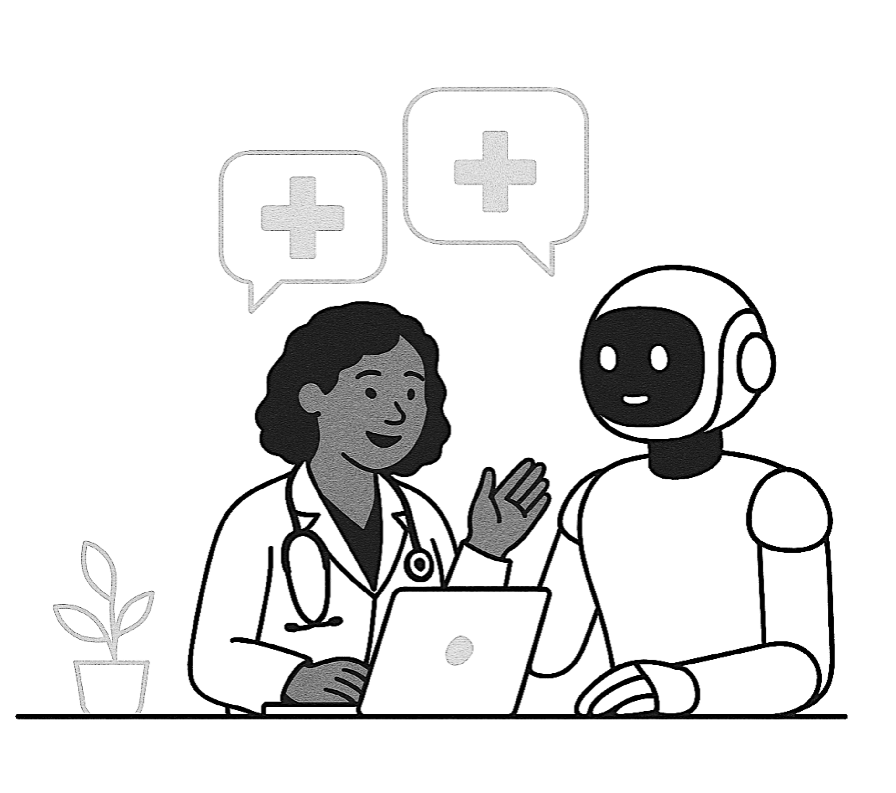

# MICCAI 2025 Human-AI Collaboration Workshop (HAIC)

## Overview

The success of Artificial Intelligence (AI) in dynamic, real-world healthcare environments increasingly depends on effective collaboration between AI and human healthcare experts. Despite the rapid advancement of AI, significant questions remain regarding the role of human factors and the establishment of best practices for human-AI collaboration.  

**The MICCAI 2025 Human-AI Collaboration (HAIC) Workshop** offers the first systematic discussion forum addressing all aspects surrounding human-AI collaboration for the MICCAI community. Through this workshop, we aim to raise awareness about human-AI collaboration in MIC and CAI and spark discussions on identifying and addressing frequently overlooked challenges that involve human factors in MIC and CAI. 

The workshop will be held in conjunction with the [28th International Conference on Medical Image Computing and Computer Assisted Intervention](https://conferences.miccai.org/2025/en/default.asp) at Daejeon Convention Center, Daejeon, South Korea. 

## News

[April 3, 2025] Website for MICCAI HAIC workshop is online!

## Call for Papers

We call for original, unpublished works that cover innovative methodologies, validation, application, or best practices for human-AI collaboration in medical image computing and computer-assisted interventions. Please find it below a non-exhaustive list of themes and topics.

### List of Themes

**Collaborative approaches and decision making**

- Interactive predictors (e.g., classification, detection, and segmentation)
  
- Human-AI collaborative/assistive agents

**Medical procedure analysis and skill augmentation**
  
- Video analysis, interpretation, and action modeling for imaging and/or intervention procedures

- AI-assisted guidance and navigation for imaging and intervention

- AI-assisted medical text mining

- Agents and agent systems inspired by human behaviors and specializations

- AI assistants for medical education

- AI-accelerated medical science: hypothesis generation, experiment planning, implementation, and outcome interpretation

**Building virtual environments to enhance human skills and human-AI teaming outcomes**
- Simulation environments for training and skill enhancement.

- Virtual/augmented/mixed reality applications for HAIC

**Emerging techniques for natural human-AI communication**

- Multimodal models that incorporate textual information (e.g., for medical question answering, diagnosis, and/or treatment planning)

- Incorporating human-friendly inputs: (e.g., natural language, audio, gesture, and gaze)

- Conversational models

- Patient-facing models

**Human-in-the loop model training**

- Active learning approaches and applications

- Incorporating structured/unstructured human feedback (e.g., natural language instruction, preference labels) in training

**Transparency, interpretability, and risk management**  

- Explainable medical AI and/or its impact on joint decisions

- Reasoning-empowered models

- Out-of-distribution management, hallucination mitigation, and decision-deferrals

- Learning to safeguard AI and human users

**Assessment and metrics for joint systems and workflows**

- Constructing new evaluation datasets  

- Identifying new clinically accepted evaluation metrics or gold standards
- Case study on existing human-AI joint workflows

**Applications: involving any of the above elements**

### Author Guidelines
**Format:** Submissions are required to follow the same [format](https://conferences.miccai.org/2025/en/PAPER-SUBMISSION-GUIDELINES.html) as specified for the MICCAI 2025 main conference: a maximum of 8 pages of main content, with up to 2 additional pages for references. All submissions should follow the Springer LNCS [LaTeX](https://conferences.miccai.org/2025/files/downloads/MICCAI2025-LaTeX-Template.zip) or [Word](https://conferences.miccai.org/2025/files/downloads/MICCAI2025-Word-Template.zip) template. 

**Review Process:** All submissions will undergo a double-blind peer-review process by multiple reviewers. 

**Presentations:** All accepted submissions will be invited for in-person poster presentations. A selected subset of works will be invited for oral or spotlight presentations. The decision on presentation format will be based on the reviewers' overall feedback and ranking. 

**Workshop Proceedings:**: 
Workshop proceedings with be published with the [Springer Lecture Notes in Computer Science (LNCS) series](https://www.springer.com/gp/computer-science/lncs). 

### Submission Guidelines
**Submission Portal:** Please submit your paper through the workshop's [CMT submission link]() (TBA). 

**Submission Deadline:** June 25, 2025 (23:59 PST). 

## Program

### Keynote Speakers (Tentative)

[**Prof. Helen Higham**](https://www.neuroscience.ox.ac.uk/research-directory/helen-higham) (Director of the OxSTaR Centre, University of Oxford, UK)

[**Prof. Nassir Navab**](https://www.cs.cit.tum.de/camp/members/cv-nassir-navab/nassir-navab/) (Director of CAMP, Technical University of Munich, Germany)

### Program Schedule

TBA

## Important Dates
| Date  | Milestone |
|---|---|
| Submission open | April 15, 2025 (TBC) |
| **Paper submission due** | **June 25, 2025** |
| Notification of paper decisions |	July 16, 2025 | 
|Camera-ready papers due	|	July 30, 2025 | 
|Workshop proceedings due |	August 15, 2025 | 
|**Workshop date**	|		September 23 or September 27, 2025 (TBA) 

<em>(All times are 23:59 PST)</em>

## Organizers
*Alphabetical order by last name*
### Organization Committee
- Xiaoqing Guo (Hong Kong Baptist University) 

- Yueming Jin (National University of Singapore)

- Hala Lamdouar (University of Oxford)

- Qianhui Men (University of Bristol)

- Cheng Ouyang (University of Oxford)

- Manish Sahu (Johns Hopkins University)

- S. Swaroop Vedula (Johns Hopkins University)

### Advisory Board

- Qi Dou (Chinese University of Hong Kong)

- Helen Higham (University of Oxford)

- Nassir Navab (Technical University of Munich)

- Alison Noble (University of Oxford)

### Program Committee

TBA 

## Sponsors

We are actively seeking industry sponsors for this workshop. If your organization is interested in supporting or collaborating, please feel free to contact us at miccai.haic@gmail.com.

## Awards

TBA

## Contact

For general inquiries please contact miccai.haic@gmail.com

